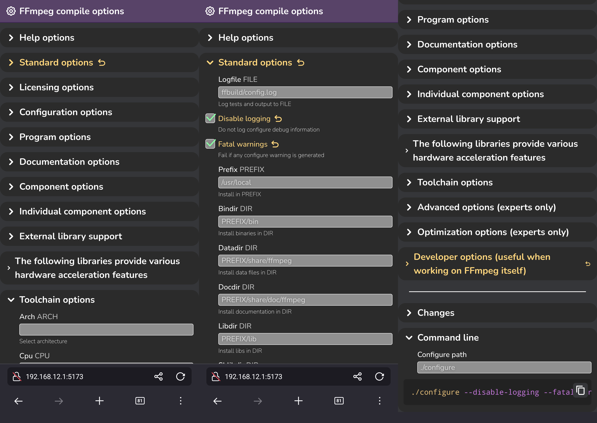

# FFmpeg compile options Web GUI

GUI interface for FFmpeg compiling options with mobile-first design.



## Launching

```bash
pnpm install
pnpm dev --open --host
```

Note: it automatically opens website to be visible on your local network. To disable it remove `--host`.

Note: copying on other devices than current development machine requires HTTPS (e.g. where it is not localhost, you need HTTPS for copying to work)

## Updating compile options

Firstly, generate `configure.txt` based on FFmpeg version:
```bash
cd .. # Go one level outside of repo directory
git clone https://git.ffmpeg.org/ffmpeg.git ffmpeg
cd ffmpeg
mkdir build
cd build
../configure --help > configure.txt
```

Generate `src/lib/data.json` from `../ffmpeg/build/configure.txt`:
```bash
# Go back to repo directory
cd scripts
python configure-json.py
```

It should update `src/lib/data.json` file depending on `../ffmpeg/build/configure.txt`. It doesn't automatically run FFmpeg `./configure` to generate `../ffmpeg/build/` build folder with `configure.txt` tho, you need to do it manually by cloning FFmpeg source code to `../ffmpeg`, creating `build/` directory and running `../configure` once from `../ffmpeg/build` directory.

## Potential improvements

- Save profiles
- Back swipe closes current section
- Clicking on a section moves header to be visible
- Few inconsistencies from FFmpeg configuration itself
    - multiple entries for `--enable-random` and `--disable-random`
    - `--enable-lto[=arg]`
    - `--env="ENV=override"`
- Fira Code font doesn't show up on my phone
- Selecting and sliding selection of generated command line doesn't work on my phone but it works with changes codeblock
- Doubleclicking on mobile sometimes when toggling headers or checkboxes selects text but I want to retain ability to select text if needed
- Select text without clicking checkmark
- Toggle for selecting multiple checkboxes by dragging finger
- Fix buttons getting smaller when header is large
- Searching for flags
- Fill in changes from an existing command line
- Even more FFmpeg tailored compile options with cleaner wrapping around decoders, encoders, demuxers, muxers, etc.

## Other configuration inconsistencies

- Mixed capitalized and uncapitalized descriptions
- `[auto]` when `[autoselect]` is used everywhere

## Project time

Took roughly 1.5 days from idea and design to full implementation.